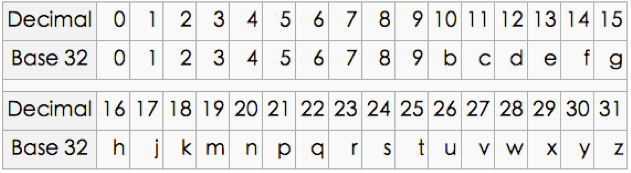

## GeoHash Introduction
GeoHash将二维的经纬度转换成字符串，比如下图展示了北京9个区域的GeoHash字符串，分别是WX4ER，WX4G2、WX4G3等等，每一个字符串代表了某一矩形区域。也就是说，这个矩形区域内所有的点（经纬度坐标）都共享相同的GeoHash字符串，这样既可以保护隐私（只表示大概区域位置而不是具体的点），又比较容易做缓存，比如左上角这个区域内的用户不断发送位置信息请求餐馆数据，由于这些用户的GeoHash字符串都是WX4ER，所以可以把WX4ER当作key，把该区域的餐馆信息当作value来进行缓存，而如果不使用GeoHash的话，由于区域内的用户传来的经纬度是各不相同的，很难做缓存。


## GeoHash Algorithm
下面以北海公园为例介绍GeoHash算法的计算步骤
### 根据经纬度计算GeoHash二进制编码
地球纬度区间是[-90,90]， 北海公园的纬度是39.928167，可以通过下面算法对纬度39.928167进行逼近编码:
1. 区间[-90,90]进行二分为[-90,0),[0,90]，称为左右区间，可以确定39.928167属于右区间[0,90]，给标记为1；
2. 接着将区间[0,90]进行二分为 [0,45),[45,90]，可以确定39.928167属于左区间 [0,45)，给标记为0；
3. 递归上述过程39.928167总是属于某个区间[a,b]。随着每次迭代区间[a,b]总在缩小，并越来越逼近39.928167；
4. 如果给定的纬度x（39.928167）属于左区间，则记录0，如果属于右区间则记录1，这样随着算法的进行会产生一个序列1011100，序列的长度跟给定的区间划分次数有关。
5. 根据纬度算编码 

| bit |     min    |     mid     |     max   |  
| :-: | :--------: |  :--------: |  :------: |  
|  1  |  -90.000   |  0.000      |  90.000   |  
|  0  |  0.000     |  45.000     |  90.000   |  
|  1  |  0.000     |  22.500     |  45.000   |  
|  1  |  22.500    |  33.750     |  45.000   |  
|  1  |  33.7500   |  39.375     |  45.000   |   
|  0  |  39.375    |  42.188     |  45.000   |  
|  0  |  39.375    |  40.7815    |  42.188   |  
|  0  |  39.375    |  40.07825   |  40.7815  |  
|  1  |  39.375    |  39.726625  |  40.07825 |  
|  1  |  39.726625 |  39.9024375 |  40.07825 |  

同理，地球经度区间是[-180,180]，可以对经度116.389550进行编码。

### 二进制组码
通过上述计算，纬度产生的编码为10111 00011，经度产生的编码为11010 01011。偶数位放经度，奇数位放纬度，把2串编码组合生成新串：11100 11101 00100 01111。

最后使用用0-9、b-z（去掉a, i, l, o）这32个字母进行base32编码，首先将11100 11101 00100 01111转成十进制，对应着28、29、4、15，十进制对应的编码就是wx4g。同理，将编码转换成经纬度的解码算法与之相反，具体不再赘述。



## GeoHash代码
### GeoHash CPP API                                                                                                                       
本[Geohash lib库](https://github.com/yangxiong868/libcpp)的编解码函数介绍。
GeoHash经纬度到字符串的编码函数：
``` cpp
bool Encode(double latitude, double longitude, uint32 precision, std::string* geohash);
```
GeoHash字符串到经纬度的解码函数：
``` cpp
bool Decode(const std::string& geohash, double* latitude, double* longitude);
```
### GeoHash 各语言代码
1. C/C++代码
https://github.com/simplegeo/libgeohash
https://github.com/windoze/geohash-cpp
2. Python代码
https://pypi.org/project/Geohash/#files
https://github.com/transitland/mapzen-geohash/blob/master/mzgeohash/geohash.py
3. Java代码
https://blog.csdn.net/sunrise_2013/article/details/42395261
4. Go代码
https://github.com/mmcloughlin/geohash

## 参考资料
[GeoHash维基百科](https://en.wikipedia.org/wiki/Geohash)
[GeoHash核心原理解析](http://www.cnblogs.com/LBSer/p/3310455.html)
[GeoHash演示](http://geohash.gofreerange.com/)
